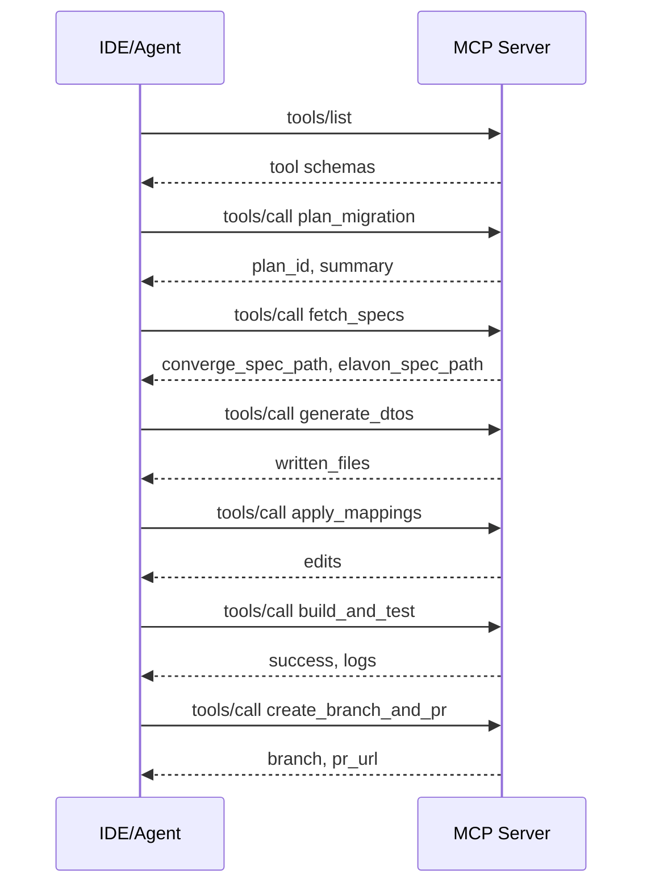

## Elavon Payments Migrator – MCP Server (Spring Boot 3, Java 17)

This mono-repo contains a Model Context Protocol (MCP) server named `payments-migrator` that upgrades Converge XML sale flows to the Elavon Transactions API. It runs as a console app (JSON-RPC 2.0 over stdio) and exposes tools to fetch OpenAPI specs, generate DTOs/SDKs, refactor services/controllers, apply request/response mappings, remove legacy XML, build, and open a PR.

### Repo layout
- `tools/mcp-payments-migrator/` – Spring Boot console app (MCP server)
- `examples/java-spring-sample/` – optional demo Spring service to migrate
- `README.md` – quick start
- `tools/mcp-payments-migrator/MCP-README.md` – server usage (copy of key sections)

### Requirements
- Java 17
- Maven 3.x (or use the Maven Wrapper included)

### Quick start
1) Build the MCP server:
```
./mvnw -q -pl tools/mcp-payments-migrator -am -DskipTests package
```

2) Run the server (stdio JSON-RPC):
```
java -jar tools/mcp-payments-migrator/target/mcp-payments-migrator-0.1.0-SNAPSHOT.jar
```

3) Test MCP handshake with a simple `tools/list` request (type JSON line and press Enter):
```
{"jsonrpc":"2.0","id":"1","method":"tools/list"}
```

You should receive a JSON response listing registered tools and their JSON Schemas. The server is framing-free (newline-delimited JSON-RPC 2.0).

### OpenAPI specs
The server can download OpenAPI specs via `fetch_specs` into:
- `tools/mcp-payments-migrator/specs/converge.json`
- `tools/mcp-payments-migrator/specs/elavon.json`

If the download fails due to auth/CORS on developer.elavon.com, manually place the files at those paths and continue. Example blob URLs:
- Converge: `blob:https://developer.elavon.com/7b3f197b-17b8-4fed-bcb7-b6724758ba6b`
- Elavon: `blob:https://developer.elavon.com/d77091d7-da4c-4e10-9e5a-fc8ba7e13cb5`

### Tools (MCP)
Implemented MCP tools:
- `plan_migration`
- `fetch_specs`
- `generate_dtos`
- `generate_sdk`
- `apply_mappings`
- `build_and_test`
- `create_branch_and_pr`
- `revert_changes`

Each tool provides strict JSON Schemas for parameters and results. All logs are redacted for PAN/CVV/track data.

### Example: end-to-end flow
1) `plan_migration` – plan id returned, languages detected, impacted files listed
2) `fetch_specs` – download or instruct manual placement
3) `generate_dtos` – generate Java models from target Elavon OpenAPI
4) `generate_sdk` – generate optional SDKs for languages
5) `apply_mappings` – refactor services/controllers, apply request/response mappings, remove legacy XML
6) `build_and_test` – compile projects; returns logs
7) `create_branch_and_pr` – create git branch and PR (or write PR body to disk if no token)

See `tools/mcp-payments-migrator/MCP-README.md` for request/response examples.

### MCP client configuration
Configure your MCP client to launch the server as a local process over stdio.

- Command:
  - Windows: `java -jar tools\\mcp-payments-migrator\\target\\mcp-payments-migrator-0.1.0-SNAPSHOT.jar`
  - macOS/Linux: `java -jar tools/mcp-payments-migrator/target/mcp-payments-migrator-0.1.0-SNAPSHOT.jar`

Example (generic JSON for MCP-capable IDEs):
```
{
  "name": "payments-migrator",
  "command": "java",
  "args": [
    "-jar",
    "tools/mcp-payments-migrator/target/mcp-payments-migrator-0.1.0-SNAPSHOT.jar"
  ],
  "env": {
    "DEFAULT_REPO_ROOT": "${workspaceFolder}"
  }
}
```

On connect, the client will call `initialize`; the server responds and publishes `initialized`, and `tools/list` will show the tool registry with descriptions and JSON Schemas.

### Example prompts (agent-facing)
- "Plan the migration from Converge XML to Elavon for this repo."
- "Fetch Converge and Elavon OpenAPI specs to tools/mcp-payments-migrator/specs."
- "Generate DTOs for TransactionInput, Card, Contact, Total, Transaction."
- "Apply Elavon mappings, unify the controller to POST /api/sale, and remove legacy XML."
- "Build and test the project and return logs."
- "Create a branch feat/migrate-converge-to-elavon and open a PR."

### Architecture (Mermaid)
```mermaid
graph TD
  A[Client IDE/Agent] -->|stdio JSON-RPC| B[MCP Server Spring Boot]
  B --> C[Tools Registry]
  C --> D[Filesystem / Git]
  C --> E[OpenAPI Generator]
  C --> F[HTTP (spec fetch)]
  C --> G[OpenRewrite / Refactor]
```

### Sequence (Mermaid)


### Security and privacy
- Redacts PAN/CVV/track data in logs and error messages
- Idempotent operations; safe re-runs
- Validates tool parameters and outputs against JSON Schemas

### Development
- Java 17, Spring Boot 3.x, Jackson
- Fat JAR packaging, console application only (no HTTP server)


